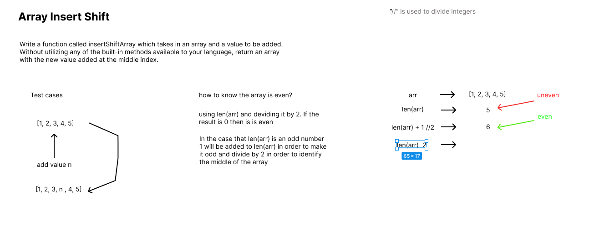

# Challenge 02
Write a function called insertShiftArray which takes in an array and a value to be added. Without utilizing any of the built-in methods available to your language, return an array with the new value added at the middle index.

## Whiteboard Process

## Approach & Efficiency
he calculation of __middle_index__ is done in constant time, __O(1)__, as it only involves a few arithmetic operations, regardless of the array's length

