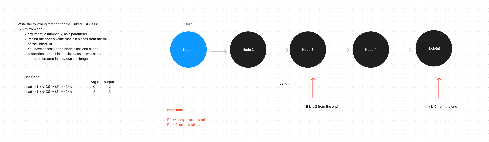

# linked-list-kth
kth from end
* argument: a number, k, as a parameter.
* Return the node’s value that is k places from 
* the tail of the linked list.
* You have access to the Node class and all the properties on the Linked List class as well as the methods created in previous challenges.

## Whiteboard Process


## Approach & Efficiency

The approach taken for the __kth_from_end__ method in the linked list involves two main steps:

* __Length Calculation:__ First, calculate the total length of the linked list. This is done by traversing the list from the head to the end, incrementing a counter for each node encountered. The traversal ensures that we know the total number of elements in the list, which is crucial for determining the position from the end.
__Traverse to Target Node:__ After calculating the length, we use the formula __target_index = length - k - 1__ to find the position of the required node from the start of the list. This formula converts the end-based index to a start-based index. We then traverse the list again from the head to this calculated target index and return the data of the node found at this position.

## Solution
```
from linked_list import LinkedList, TargetError

def test_kth_from_end():
    ll = LinkedList()
    values = ["apples", "bananas", "cucumbers"]

    for value in reversed(values):
        ll.insert(value)

    print("The whole list:", ll)

    try:
        print("0th from end:", ll.kth_from_end(0))  # Should be "cucumbers"
        print("1st from end:", ll.kth_from_end(1))  # Should be "bananas"
        print("2nd from end:", ll.kth_from_end(2))  # Should be "apples"
        print("3rd from end:", ll.kth_from_end(3))  # Should raise TargetError
    except TargetError as e:
        print(e)

test_kth_from_end()

```
